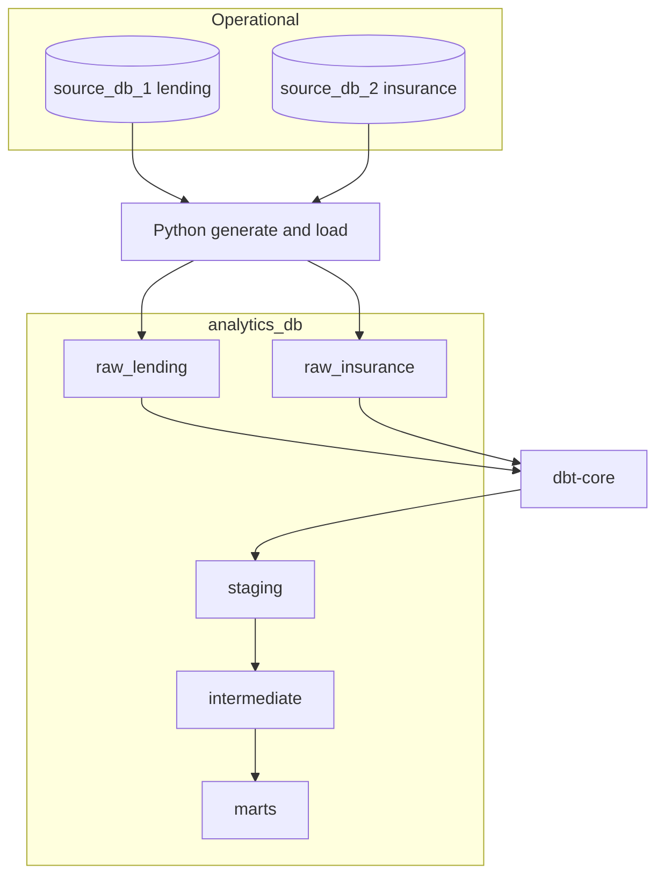

# Local finance data platform demo

Minimal, transparent stack: two operational Postgres databases (lending + insurance), one analytics Postgres with raw mirror layers, **Python** synthetic generation/load, and **dbt** for staging → intermediate → marts. No CDC, no orchestrator, no cloud.

## Documentation


| Document                                                                       | Description                                                    |
| ------------------------------------------------------------------------------ | -------------------------------------------------------------- |
| [docs/technical-design.md](docs/technical-design.md)                           | Components, topology, configuration, boundaries                |
| [docs/data-design-and-flow.md](docs/data-design-and-flow.md)                   | Entities, ER-style overview, layers, identity rules, data flow |
| [docs/data-product-design-overview.md](docs/data-product-design-overview.md)   | Mart KPIs, audiences, limitations, roadmap                     |
| [docs/data-lineage-feature-overview.md](docs/data-lineage-feature-overview.md) | dbt docs, Mermaid export, extensions                           |
| [docs/roadmap.md](docs/roadmap.md)                                             | Done vs planned: realtime, metrics/dictionary, data contracts  |
| [docs/glossary.md](docs/glossary.md)                                           | Business terms and KPI plain-language definitions               |
| [docs/catalog.md](docs/catalog.md)                                             | Optional enterprise catalog tools (DataHub, OpenMetadata, etc.)   |
| [docs/realtime-and-cdc.md](docs/realtime-and-cdc.md)                           | CDC, streaming patterns, incremental staging notes              |


## Architecture




### Why this is transparent

- **Explicit boundaries:** operational schemas stay isolated; analytics only consumes `raw_`* mirrors you can inspect with SQL.
- **dbt as documentation:** `sources.yml` declares physical tables; each model is a named step with tests.
- **Lineage:** `dbt docs generate` produces a DAG; `lineage/render_lineage.py` exports a Mermaid graph from `target/manifest.json`.

## Prerequisites

- Docker + Docker Compose
- Python **3.11–3.13** (dbt-core does not support 3.14+ yet; `scripts/bootstrap.sh` picks `python3.13` / `python3.12` / `python3.11` from PATH)

## Quick start

```bash
cp .env.example .env
# Optional: edit ports/passwords in .env

bash scripts/bootstrap.sh
source .venv/bin/activate

make up          # start three Postgres containers
make seed-data   # synthetic data → sources + raw mirror on analytics_db
make transform   # dbt run
make test        # dbt test
make validate-contracts  # align contracts/schemas/*.yaml with dbt sources.yml
make docs        # dbt docs generate (artifacts under dbt_project/target/)
make lineage     # lineage/lineage.mmd + lineage/lineage.md
```

One-shot (starts Docker, waits briefly, then seed + dbt + tests + docs + lineage):

```bash
make demo
```

**dbt profile:** `scripts/bootstrap.sh` copies `dbt_project/profiles.yml.example` → `dbt_project/profiles.yml`. All targets use `DBT_PROFILES_DIR` pointing at `dbt_project/` and read `ANALYTICS_DB_`* from `.env`.

## Source → mart flow


| Source (operational + raw mirror) | Staging                         | Intermediate                                           | Marts                             |
| --------------------------------- | ------------------------------- | ------------------------------------------------------ | --------------------------------- |
| `raw_lending.branches`            | `stg_lending_branches`          | —                                                      | `dim_branch`                      |
| `raw_lending.customers`           | `stg_lending_customers`         | `int_customer_identity_resolution`, `int_customer_360` | `dim_customer`                    |
| `raw_lending.loan_applications`   | `stg_lending_loan_applications` | —                                                      | (via facts context)               |
| `raw_lending.loans`               | `stg_lending_loans`             | `int_daily_loan_cashflow`                              | `fct_loan_disbursement`           |
| `raw_lending.repayments`          | `stg_lending_repayments`        | `int_daily_loan_cashflow`                              | `fct_repayment`                   |
| `raw_insurance.policy_holders`    | `stg_insurance_policy_holders`  | identity + `int_customer_360`                          | `dim_customer`                    |
| `raw_insurance.policies`          | `stg_insurance_policies`        | `int_policy_claim_summary`                             | `fct_policy`                      |
| `raw_insurance.claims`            | `stg_insurance_claims`          | `int_policy_claim_summary`                             | `fct_claim`                       |
| (calendar spine)                  | —                               | —                                                      | `dim_date`                        |
| Facts + dims                      | —                               | —                                                      | `mart_branch_monthly_performance` |


## Data model notes

- **Grains:** `fct_loan_disbursement` = one row per loan; `fct_repayment` = one row per repayment; `fct_policy` = one row per policy; `fct_claim` = one row per claim; `mart_branch_monthly_performance` = `branch_id` × `month_start_date`.
- **Auditing:** Staging carries `record_source`, `source_system`, and `loaded_at` (from raw `loaded_at` when present).
- `**dim_customer.customer_key`:** equals `master_customer_id` from identity resolution (MD5-based deterministic surrogate).

## Identity resolution (deterministic)

Implemented in `int_customer_identity_resolution`:

1. **National ID:** match when both sides have the same non-null `national_id` (one-to-one preference via row windows if duplicates appear).
2. **Phone + normalized name:** for remaining rows, match on `phone_number` and identical normalized full name (uppercase, collapsed whitespace).
3. **Unmatched:** lending-only or insurance-only masters for the residual rows.

Inspect match quality:

```sql
select match_method, count(*) from intermediate.int_customer_identity_resolution group by 1;
```

## Inspecting lineage

- **dbt Docs:** after `make docs`, run `cd dbt_project && dbt docs serve --project-dir . --profiles-dir .` and open the lineage graph in the browser.
- **Mermaid export:** `lineage/lineage.md` (and `lineage/lineage.mmd`) from `make lineage`.

## Example validation queries

```sql
-- Mart preview
select *
from marts.mart_branch_monthly_performance
order by month_start_date desc, branch_id
limit 20;

-- Cross-check disbursements vs fact
select count(*) from marts.fct_loan_disbursement;

-- Customer dimension with both source ids
select customer_key, lending_customer_id, insurance_policy_holder_id, match_method
from marts.dim_customer
where lending_customer_id is not null
  and insurance_policy_holder_id is not null
limit 20;
```

## Synthetic data volumes (approximate)


| Entity            | Count |
| ----------------- | ----- |
| Lending customers | 2,000 |
| Policy holders    | 2,000 |
| Branches          | 5     |
| Loan applications | 3,000 |
| Loans             | 2,000 |
| Repayments        | 8,000 |
| Policies          | 1,500 |
| Claims            | 300   |


Overlap: ~900 exact national_id matches, ~200 phone+name matches (insurance `national_id` intentionally null), ~900 lending-only, ~900 insurance-only — designed to surface mastering edge cases.

## Metabase (optional BI)

With the stack up (`make up`), start Metabase using the Compose profile **`bi`**:

```bash
docker compose --profile bi up -d
```

Open `http://localhost:${METABASE_PORT:-3000}` (see `.env.example`). Add a database connection using host **`analytics_db`**, port **5432**, database **`analytics_db`**, and the same user/password as `ANALYTICS_DB_*` (this hostname works from inside the Docker network; from the host use `localhost` and mapped port **5435** if you run Metabase outside Compose).

Semantic metrics for `mart_branch_monthly_performance` are defined in dbt ([dbt_project/models/marts/_mart_branch_monthly_semantic.yml](dbt_project/models/marts/_mart_branch_monthly_semantic.yml)); Metabase can query marts directly or mirror metric names in its metric layer.

## Tradeoffs and next steps

- **Default reload:** batch via `make seed-data`; optional **Prefect** flow in `orchestration/refresh_flow.py` (see `requirements-orchestration.txt`).
- **`stg_lending_loans` is incremental** (merge on `loan_id`, watermark `loaded_at`). First-time or after model changes: `dbt run --select stg_lending_loans --full-refresh`.
- **Source Postgres** runs with `wal_level=logical` for future CDC; see [docs/realtime-and-cdc.md](docs/realtime-and-cdc.md).
- **Identity rules are intentionally simple:** no probabilistic matching, no manual overrides table.
- **Branch attribution for insurance:** policies and claims roll up to `primary_branch_id` only when the holder resolves to a lending customer; pure insurance customers are excluded from branch KPIs (documented choice for this demo).
- **Roadmap:** [docs/roadmap.md](docs/roadmap.md) (SCD2, full streaming stack, Soda/GE, catalog deployment, etc.).

## Ports (default `.env.example`)


| Service      | Host port |
| ------------ | --------- |
| source_db_1  | 5433      |
| source_db_2  | 5434      |
| analytics_db | 5435      |


## License

Internal demo / educational use.