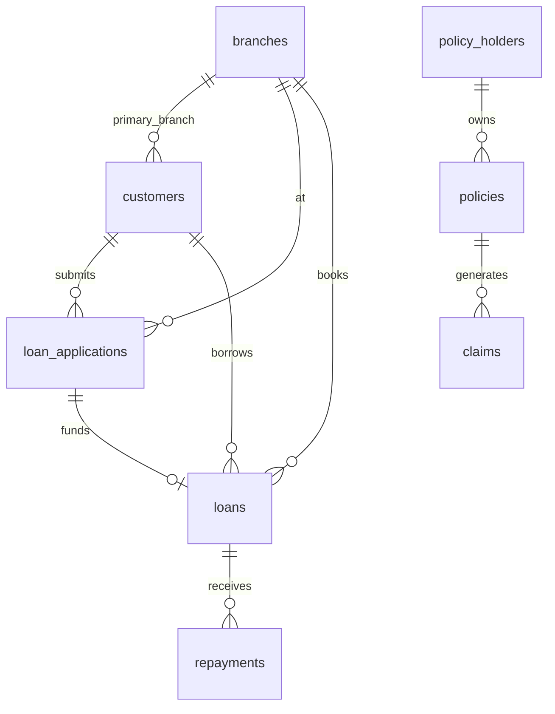
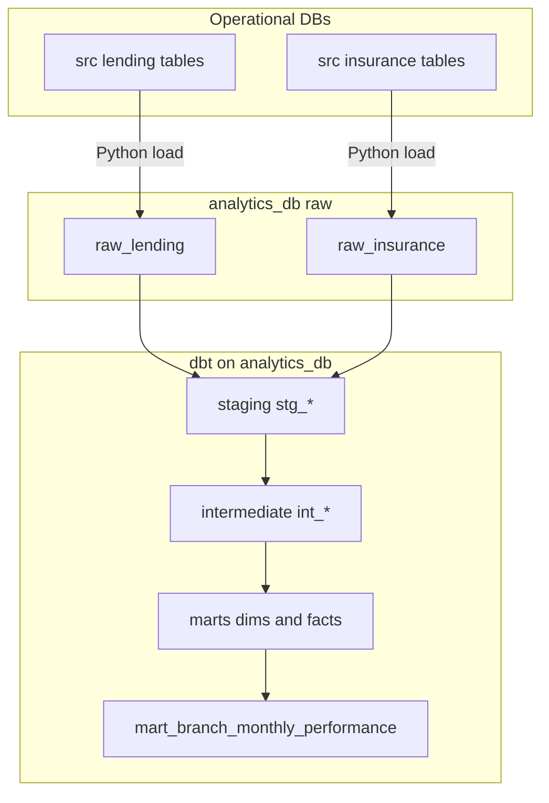

# Data design and flow overview

This document summarizes **entities**, **relationships**, **layering**, and **end-to-end flow** from operational sources to marts.

## 1. Business context

A small finance company runs two systems:

- **Lending (source_db_1):** customers, branches, applications, loans, repayments.
- **Insurance (source_db_2):** policy holders, policies, claims.

**Identity is intentionally messy:** some people exist in both systems with aligned keys; some match only on phone + normalized name; some exist on one side only. That motivates **conformed dimensions** and **explicit identity resolution**.

## 2. Source ER (conceptual)

## 3. Raw mirror (`analytics_db`)

Operational tables are **copied** into:

- `raw_lending.*` — same grain as lending source.
- `raw_insurance.*` — same grain as insurance source.

`loaded_at` on raw tables records **mirror load time** (set by Python), supporting audit and freshness discussion in demos.

## 4. Layered warehouse model

### 4.1 Staging (`staging`)

Purpose: stable column names, light typing, **audit columns** (`record_source`, `source_system`, `loaded_at`), and **normalized_full_name** for matching.

| Model | Primary source |
|-------|----------------|
| `stg_lending_branches` | `raw_lending.branches` |
| `stg_lending_customers` | `raw_lending.customers` |
| `stg_lending_loan_applications` | `raw_lending.loan_applications` |
| `stg_lending_loans` | `raw_lending.loans` |
| `stg_lending_repayments` | `raw_lending.repayments` |
| `stg_insurance_policy_holders` | `raw_insurance.policy_holders` |
| `stg_insurance_policies` | `raw_insurance.policies` |
| `stg_insurance_claims` | `raw_insurance.claims` |

### 4.2 Intermediate (`intermediate`)

| Model | Purpose |
|-------|---------|
| `int_customer_identity_resolution` | Deterministic match: (1) `national_id`, (2) phone + normalized name, (3) unmatched sides |
| `int_customer_360` | One row per resolution outcome with lending + insurance attributes |
| `int_daily_loan_cashflow` | Repayments aggregated by loan × day |
| `int_policy_claim_summary` | Policies with claim counts and amounts |

### 4.3 Marts (`marts`)

**Dimensions**

| Model | Grain / key |
|-------|-------------|
| `dim_date` | One row per calendar day (`date_key`) |
| `dim_branch` | One row per branch (`branch_key` = surrogate over `branch_id`) |
| `dim_customer` | One row per `master_customer_id`; `customer_key` = `master_customer_id` |

**Facts**

| Model | Grain |
|-------|--------|
| `fct_loan_disbursement` | One row per **loan** (disbursement event) |
| `fct_repayment` | One row per **repayment** |
| `fct_policy` | One row per **policy** |
| `fct_claim` | One row per **claim** |

**Aggregate mart**

| Model | Grain | Role |
|-------|--------|------|
| `mart_branch_monthly_performance` | `branch_id` × `month_start_date` | Executive-style KPIs |

## 5. Identity resolution rules (deterministic)

Implemented in `int_customer_identity_resolution`:

1. **National ID:** Match when both sides have the same non-null `national_id`. Row windows reduce accidental many-to-many on duplicates.
2. **Phone + name:** For remaining rows, match on `phone_number` and identical **normalized** full name (uppercase, collapsed whitespace).
3. **Unmatched:** Lending-only or insurance-only masters for residual IDs.

`match_method` documents the rule used: `national_id`, `phone_and_name`, `unmatched_lending`, `unmatched_insurance`.

## 6. Branch attribution for insurance KPIs (demo rule)

Policies and claims are rolled up to a **branch** only when the policy holder resolves to a lending customer with a non-null `primary_branch_id`. Pure insurance customers are **excluded** from branch-level insurance measures in this mart—this is a **documented product choice** for simplicity, not a universal business rule.

## 7. End-to-end flow (logical)

## 8. Synthetic data volumes (targets)

Approximately: 2,000 lending customers, 2,000 policy holders, 5 branches, 3,000 applications, 2,000 loans, 8,000 repayments, 1,500 policies, 300 claims; timestamps skewed across the last 12 months.

## 9. Slowly changing attributes

This demo uses **Type 1–style** current-state dimensions (no explicit `valid_from` / `valid_to` on `dim_customer`). A natural next step is SCD2 for name or branch changes.
