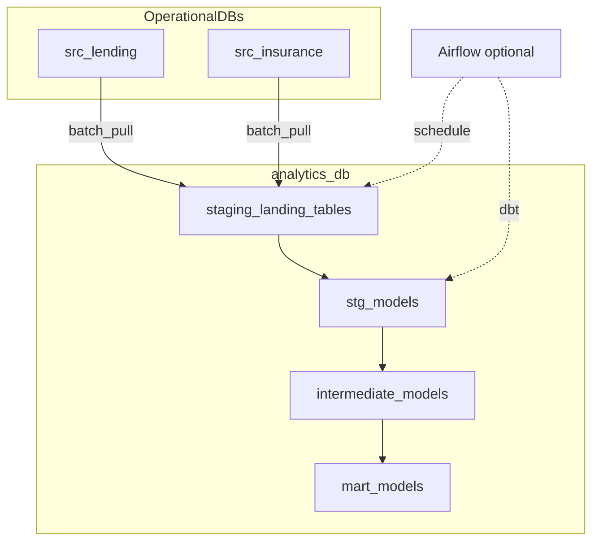

# Data design and flow overview

This document summarizes entities, relationships, layering, and end-to-end flow from operational sources to marts.

## 1. Business context

A small finance company runs two systems:
- **Lending (`source_db_1`)**: customers, branches, applications, loans, repayments.
- **Insurance (`source_db_2`)**: policy holders, policies, claims.

Identity is intentionally messy, so the warehouse builds conformed dimensions and deterministic identity resolution.

## 2. Staging landing (`analytics_db.staging`)

Operational tables are pulled directly into landing tables:
- `staging.lending_branches`
- `staging.lending_customers`
- `staging.lending_loan_applications`
- `staging.lending_loans`
- `staging.lending_repayments`
- `staging.insurance_policy_holders`
- `staging.insurance_policies`
- `staging.insurance_claims`

Each table carries `loaded_at` for auditability and incremental logic.

## 3. Layered warehouse model

### 3.1 Staging models (`staging` schema)

| Model | Primary source |
|-------|----------------|
| `stg_lending_branches` | `staging.lending_branches` |
| `stg_lending_customers` | `staging.lending_customers` |
| `stg_lending_loan_applications` | `staging.lending_loan_applications` |
| `stg_lending_loans` | `staging.lending_loans` |
| `stg_lending_repayments` | `staging.lending_repayments` |
| `stg_insurance_policy_holders` | `staging.insurance_policy_holders` |
| `stg_insurance_policies` | `staging.insurance_policies` |
| `stg_insurance_claims` | `staging.insurance_claims` |

### 3.2 Intermediate (`intermediate`)

- `int_customer_identity_resolution`: deterministic matching rules.
- `int_customer_360`: mastered customer record.
- `int_daily_loan_cashflow`: repayment rollups.
- `int_policy_claim_summary`: policy-claim aggregations.

### 3.3 Marts (`marts`)

- Dimensions: `dim_date`, `dim_branch`, `dim_customer`.
- Facts: `fct_loan_disbursement`, `fct_repayment`, `fct_policy`, `fct_claim`.
- Aggregate: `mart_branch_monthly_performance`.

## 4. End-to-end flow

Logical order: **operational DBs → staging landing → dbt staging models → intermediate → marts**. The default implementation uses a Python batch job (`data_gen.load_data`) to refresh sources and copy into landing tables; **optional** [Apache Airflow](../airflow/dags/finance_demo_daily.py) (Compose profile `airflow`) runs the same sequence on a schedule with a logical run date via `LOAD_DATA_AS_OF`.

